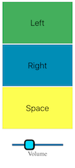
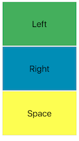
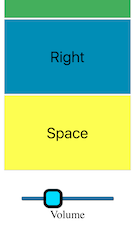

# RemoteControl

RemoteControl is a tiny Python 3.6 Flask app that can 
transmit key code instructions to operating system 
from a web interface. Currently it only supports OSX 
and uses a Python wrapper for `NSAppleScript` to communicate 
with the operating system. 

It has a very basic UI with controls for `left`, `right`, `space`, 
and `volume`.

Primarily usage is for controlling video playback
 (forward, rewind, pause/play) in full screen 
mode on YouTube or VLC or other media players.

#### Architecture

Simple REST API based architecture with query params.
Serves HTML page on root

#### Screenshots

| Full screen | Upper view  | Lower view  |
| :---------: | :---------: | :---------: |
|  |||


## Installation

- Clone the repository

- Install requirements from `requirements.txt`

- Run it using this command
```bash
gunicorn -b 0.0.0.0:8081 -w 4 app:app
```

- Visit the IP address of your machine in a 
browser on a remote machine and you should be able to access
the UI


## Future features

- [ ] Basic Auth
- [ ] Support for Windows
- [ ] Support for Linux
- [ ] Additional key codes
- [ ] Redesign UI 
- [ ] Package as a single executable

## Contributing
Pull requests are welcome. For major changes, please open an issue first to discuss what you would like to change.

## License
[MIT](https://choosealicense.com/licenses/mit/)

###### P.S. - This project was implemented in few minutes on Christmas Eve 2018, code quality is not representative of production code and requires significant improvements